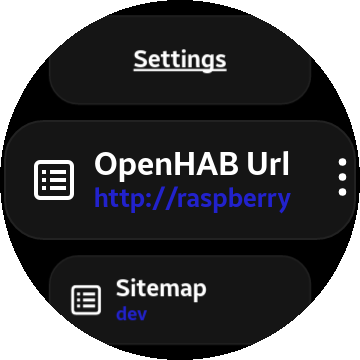
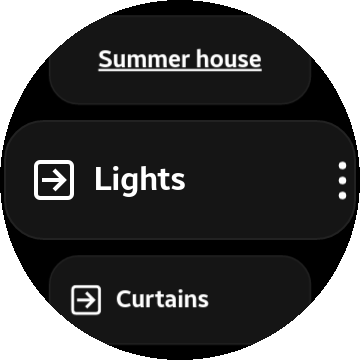
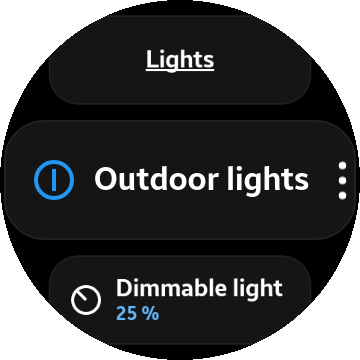
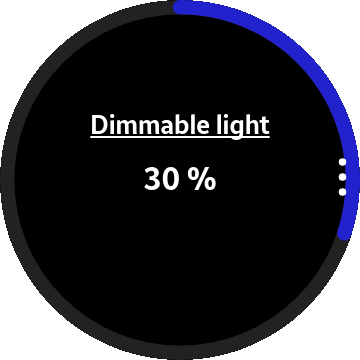

# Remote for openHAB

Unofficial UI for [openHAB](https://www.openhab.org/) running on Tizen based Samsung smart watches,
i.e. the Gear and Galaxy line of smart watches with a circular display.
The UI is implemented with [Vue.js](https://vuejs.org/) and uses the openHAB REST API to retrieve a 
[sitemap](https://www.openhab.org/docs/configuration/sitemaps.html) which is then rendered on the watch.

Visit the Samsung Galaxy Store to install on a compatible device:

Currently the following sitemap element types are supported:
* _Frame_ - Displays a heading before its contents
* _Group_ - Displays the label and links to a sub-view
* _Text_ - Behaves like the Group element
* _Switch_ - Renders an on/off toggle or shows a list of options. Rollershutter and Player have custom rendering. 
* _Selection_ - Renders a list of options.  
* _Setpoint_ - Shows a slider and the value. Changes are done by rotating the bezel.
* _Slider_ - Behaves like Setpoint

Any other element type will be ignored when rendering and won't show up. 

## Screenshots

## Developing
Development is best done in a local browser and your editor/IDE of choice supporting modern web technology.

### Prerequisites
#### Node and npm 
A recent version of node.js and npm is required. Then run *npm install* followed by *npm start*.

You can then fire up your browser and visit http://localhost:8080. It's probably safest to use Chrome or Chromium 
since that's what seems to be the rendering engine in Tizen since version 3.

If you need to remote debug the web app on an emulator or watch (grunt debug) you need to use Chrome.

#### Disable CORS
When the application is run on a device or emulator it's a standalone application and CORS is not an issue, but when
running in a browser it's loaded as a web site from the webpack dev server and affected by CORS security. 

To get around this you'll either have to [enable CORS on your openHAB instance](https://www.openhab.org/docs/configuration/restdocs.html#additional-considerations), 
or alternatively disable CORS in the browser. To do this in Chrome you have to launch with command line flags:

`[path to]/chrome --user-data-dir=$HOME/tmp/chrome/cors --disable-web-security`

#### Tizen Studio
Building and deploying on an emulator or actual watch requires tools from Tizen Studio, 
specifically the *tizen* and *sdb* executables. Once Tizen Studio is installed,
the TIZEN_HOME environment variable must be set to the installation directory. 

#### Certificates
When deploying to an emulator or watch you also need 
[Samsung developer certificates](https://developer.samsung.com/galaxy-watch/develop/getting-certificates) 
and a certificate profile named *Samsung*. The name of the profile is configured in *gruntfile.js*
